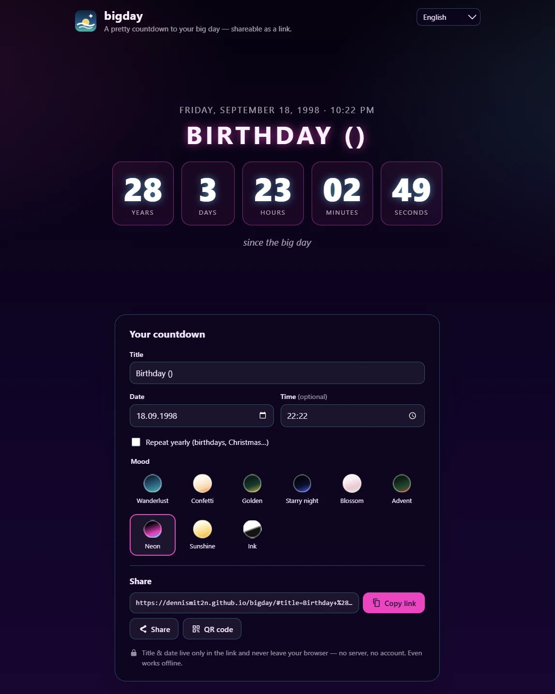

# bigday


**➡️ Ausprobieren: [dennismit2n.github.io/bigday](https://dennismit2n.github.io/bigday/)** &nbsp;·&nbsp; 🇬🇧 [English version of this page](README.md)

Der hübsche Countdown zum großen Tag — Urlaub, Geburtstag, Ruhestand, worauf auch immer du dich freust. Datum, Titel und Stimmung wählen, Link teilen. Der komplette Countdown steckt im Link: kein Server, keine Datenbank, kein Konto.



## Funktionen

- 🎨 **9 kuratierte Stimmungen** — Fernweh, Konfetti, Golden, Sternenhimmel, Zart, Advent, Neon, Sonne, Tinte — jede mit handpolierter Palette. Acht davon tragen eine dezente Hintergrund-Animation, Tinte ist bewusst still.
- ⏱️ **Live-Ticker** — Tage, Stunden, Minuten, Sekunden (bei fernen Zielen zusätzlich Jahre), sekundengenau
- 🎉 **Der große Moment** — bei null feiert die Seite mit Konfetti; danach zählt sie *vorwärts* („seit 3 Tagen…"), alte Links bleiben also lebendig
- 🔁 **Jährlich wiederholen** — Geburtstage und Feste springen nach dem Festtag automatisch aufs nächste Jahr
- 🔗 **Teilen als Link, QR-Code oder über das Teilen-Menü des Handys** — wer den Link öffnet, sieht genau die gewählte Stimmung
- 🕰️ **Lokale Zeit** — gezählt wird in der Zeitzone des Betrachters; die Uhrzeit ist optional (Standard: Mitternacht)
- 🌍 **14 Sprachen** — Deutsch, English, Español, Français, Italiano, Nederlands, Polski, Português, Türkçe, Русский, हिन्दी, 中文, 日本語, 한국어 (automatisch erkannt)
- 📱 **Installierbare PWA** — Countdown auf den Homescreen legen; funktioniert nach dem ersten Besuch auch offline
- 🔒 **Radikal privat** — Titel & Datum stecken im URL-*Fragment* (`#…`), das Browser nie an einen Server senden

## Datenschutz

Die ganze App ist eine Handvoll statischer Dateien. Alles, was du eintippst, wird in den Teil der URL nach dem `#` kodiert — das Fragment —, das dein Browser nie an einen Server überträgt. Titel und Datum deines Countdowns landen also in keinem Server-Log. Der Link selbst ist aber unverschlüsselter Klartext: Wer ihn hat oder weitergeleitet bekommt, liest Titel und Datum direkt in der Adresszeile — und auch der Messenger, über den du ihn verschickst, dein Browser-Verlauf und deine Lesezeichen speichern ihn mitsamt Titel. Es gibt keinerlei Server-Logik: Flugmodus an, und es funktioniert trotzdem.

*Statistik:* Die App nutzt [GoatCounter](https://www.goatcounter.com) für anonyme Besucherzählung ohne Cookies (im Footer deklariert). Das Skript liegt lokal in `js/vendor/count.js`; die einzige externe Anfrage ist das Zählpixel — und das enthält nie das Fragment, also nie deine Countdown-Daten.

## Gut zu wissen

- Ein Datum in der Vergangenheit zählt einfach **vorwärts** — „10 Jahre verheiratet" funktioniert von selbst.
- Emojis im Titel funktionieren: `Ruhestand 🎉🏖️`.

## Entwicklung

Kein Build-Schritt, keine Abhängigkeiten.

```bash
node tools/dev-server.js
```

Dann http://localhost:8616 öffnen. Ändern, neu laden, fertig.

**Beim Deploy:** die `CACHE`-Konstante in [sw.js](sw.js) hochzählen, damit installierte Clients die neue Version sofort bekommen. (Der Service Worker aktualisiert gecachte Dateien zusätzlich im Hintergrund — stale-while-revalidate —, ein vergessener Bump heilt sich also beim nächsten Besuch von selbst.)

## Übersetzungen

Die Oberflächentexte liegen in [js/i18n.js](js/i18n.js). Einige Übersetzungen sind maschinell erstellt — wenn etwas in deiner Sprache schief klingt, freuen wir uns sehr über Korrekturen per Pull Request oder Issue!

## Ideen für später

- Bild-Export (Countdown-Karte als PNG für Story/Status) — wenn Nutzer danach fragen

## Lizenz

[MIT](LICENSE) für alles in diesem Repository, mit zwei Ausnahmen, beide im Kopf der jeweiligen Datei angegeben: `js/vendor/qrcode.js` und `js/vendor/qrcode_UTF8.js` sind der QR-Generator von [Kazuhiko Arase](https://github.com/kazuhikoarase/qrcode-generator) (MIT), und `js/vendor/count.js` ist das Zählskript von GoatCounter (ISC). „QR Code“ ist eine eingetragene Marke von DENSO WAVE INCORPORATED.
