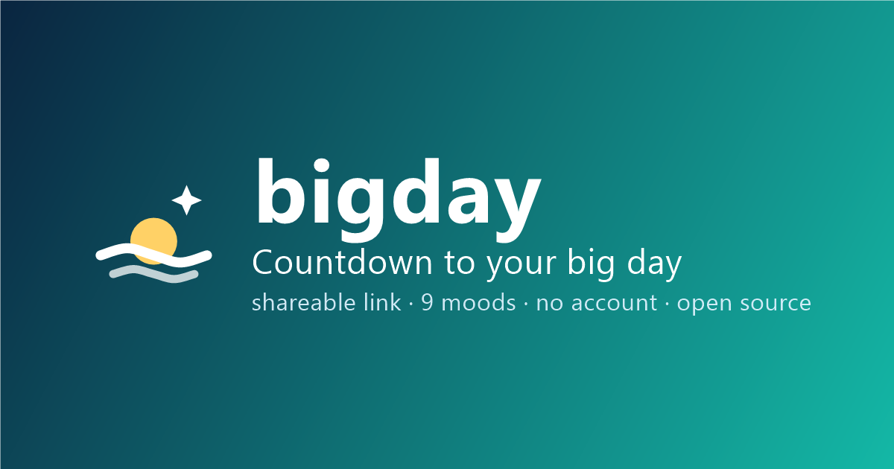

# bigday



**➡️ Try it: [dennismit2n.github.io/bigday](https://dennismit2n.github.io/bigday/)** &nbsp;·&nbsp; 🇩🇪 [Deutsche Version dieser Seite](README.de.md)

A pretty countdown to your big day — vacation, birthday, retirement, whatever you're looking forward to. Pick a date, a title and a mood, and get a link you can share. The entire countdown lives in that link: no server, no database, no account.

## Features

- 🎨 **9 curated moods** — Wanderlust, Confetti, Golden, Starry night, Blossom, Advent, Neon, Sunshine, Ink — each with its own hand-tuned palette. Eight carry a gentle ambient animation; Ink is deliberately still.
- ⏱️ **Live ticker** — days, hours, minutes, seconds (plus years for far-away dates), ticking in real time
- 🎉 **The big moment** — when the countdown hits zero, the page celebrates with confetti; afterwards it counts *up* ("3 days since the big day"), so old links stay alive
- 🔁 **Yearly repeat** — birthdays and holidays roll over to next year automatically after the party day
- 🔗 **Share as a link, QR code or via your phone's share sheet** — the recipient sees exactly the mood you picked
- 🕰️ **Local time** — the target counts down in each viewer's own time zone; time of day is optional (defaults to midnight)
- 🌍 **12 languages** — Deutsch, English, Español, Français, Italiano, Português, Türkçe, Русский, हिन्दी, 中文, 日本語, 한국어 (auto-detected)
- 📱 **Installable PWA** — put your countdown on the home screen; works offline after the first visit
- 🔒 **Radically private** — title & date live in the URL *fragment* (`#…`), which browsers never send to any server

## Privacy

The whole app is a handful of static files. Everything you type is encoded into the part of the URL after `#` — the fragment — which your browser never transmits to any server, so your countdown's title and date stay between you and the people you share the link with. There is no server-side anything: turn on airplane mode and it still works.

*Analytics:* the app uses [GoatCounter](https://www.goatcounter.com) for anonymous, cookieless visit counting (disclosed in the footer). The script is vendored locally in `js/vendor/count.js`; the only external request is the count pixel — and it never includes the fragment, i.e. never your countdown data.

## Nice to know

- A date in the past simply counts **up** — "10 years married" works out of the box.
- Emoji work fine in the title: `Retirement 🎉🏖️`.

## Development

No build step, no dependencies.

```bash
node tools/dev-server.js
```

Then open http://localhost:8616. Edit, reload, done.

**When deploying:** bump the `CACHE` constant in [sw.js](sw.js) so installed clients pick up the new version immediately. (The service worker also refreshes cached assets in the background — stale-while-revalidate — so even a forgotten bump heals itself on the visitor's next visit.)

## Translations

Interface strings live in [js/i18n.js](js/i18n.js). Some translations are machine-generated — if something sounds off in your language, corrections via pull request or issue are very welcome!

## Roadmap ideas

- Image export (countdown card as PNG for stories/status) — if users ask for it

## License

[MIT](LICENSE) for everything in this repository, with two exceptions, both stated in their file headers: `js/vendor/qrcode.js` and `js/vendor/qrcode_UTF8.js` are the QR generator by [Kazuhiko Arase](https://github.com/kazuhikoarase/qrcode-generator) (MIT), and `js/vendor/count.js` is GoatCounter's counter script (ISC). "QR Code" is a registered trademark of DENSO WAVE INCORPORATED.
